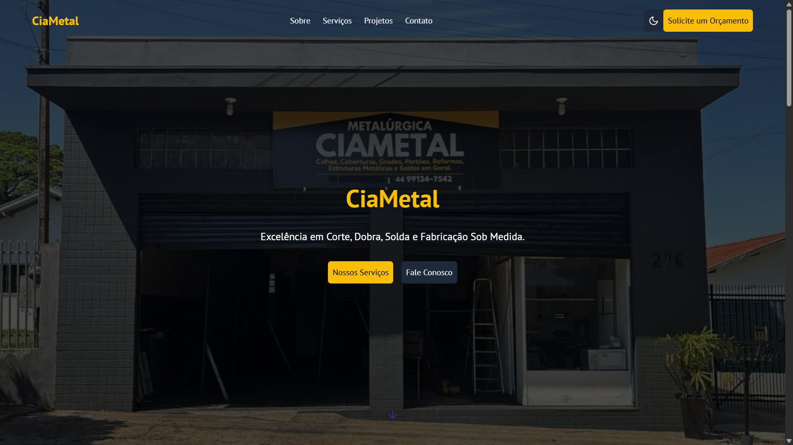

# Projeto de Extensão UNIPAR - Website CiaMetal

Este repositório contém o código-fonte do website institucional desenvolvido para a empresa **Metalúrgica CiaMetal**, como parte do projeto de extensão do curso de Análise e Desenvolvimento de Sistemas da Universidade Paranaense (UNIPAR).

---

## 🚀 Site em Produção (Demo)

**Visite o site em funcionamento:** [**metalurgica-ciametal-ext.vercel.app**](metalurgica-ciametal-ext.vercel.app)

*(Substitua o link acima pelo seu link real da Vercel)*

---

## 📸 Demonstração Visual

---

## 1. Sobre o Projeto

O objetivo principal deste projeto de extensão é aplicar os conhecimentos teóricos adquiridos em sala de aula na criação de uma solução prática e de valor para uma empresa real da comunidade.

A empresa escolhida para este projeto foi a **Metalúrgica CiaMetal**, uma serralheria local que necessitava de uma presença digital moderna para servir como portfólio online e canal de captação de clientes.

## 2. Equipe

* **Thiago Pacheco dos Santos** - RA: 60004984
* **Glauter Junior Alberico** - RA: 60006591
* **Cauã Aparecido Torres** - RA: 60007309
* **Victor Hugo de Assunção Jaques** - RA: 60009823

## 3. Tecnologias e Metodologias

* **HTML5:** Estruturação semântica do website.
* **CSS3:** Estilização moderna e design responsivo (Mobile-First) utilizando Flexbox e Grid.
* **JavaScript (Vanilla):** Implementação de interatividade, como o carrossel de imagens, o menu *mobile* e o modo escuro (Dark Mode).
* **Controlo de Versão (Git):** Todo o código-fonte foi versionado utilizando Git e hospedado no GitHub.
* **Hospedagem (Vercel):** O website está hospedado na plataforma Vercel, que oferece *deploy* contínuo (CI/CD) integrado ao repositório.

## 4. Desafios Técnicos e Soluções

Um dos principais desafios foi a implementação do **carrossel de imagens responsivo**. O carrossel precisava de exibir 3 imagens em *desktops*, 2 em *tablets* e 1 em *smartphones*, sem deixar espaços em branco no final da lista.

**Solução:**
A lógica inicial (`currentIndex + 1`) foi substituída por um cálculo dinâmico. O JavaScript agora verifica a largura da janela (`window.innerWidth`) para determinar quantos itens (`itemsPerPage`) estão visíveis. Com base nisso, calculamos o `maxIndex` (o último slide "válido") e ajustamos os botões "próximo" e "anterior" para fazer um *loop* correto, voltando a 0 ou indo para o `maxIndex` de forma inteligente.

## 5. Competências Desenvolvidas

### Competências Técnicas (Hard Skills)

* **Desenvolvimento Front-End:** Capacidade de construir um website completo e funcional do zero.
* **Design Responsivo:** Habilidade para criar interfaces que se adaptam a diferentes tamanhos de ecrã.
* **Depuração (Debugging):** Experiência prática na identificação e correção de *bugs* de layout (CSS) e lógica (JavaScript).
* **Fluxo de Trabalho Git:** Proficiência no uso de comandos Git (`commit`, `push`, `branch`, `merge`) para gestão de código em equipe.
* **Hospedagem e CI/CD:** Conhecimento prático do processo de *deploy* de uma aplicação web real na Vercel.

### Competências Comportamentais (Soft Skills)

* Trabalho em Equipa
* Resolução de Problemas
* Gestão de Tempo
* Comunicação

